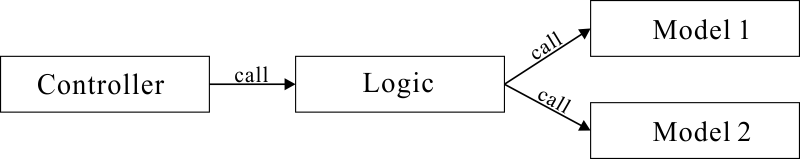
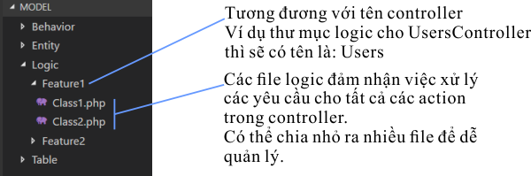

# Tổ chức code trong CakePHP 3x

## Thực tế:

Thực tế trong một hệ thống, mỗi chức năng có thể sử dụng nhiều table và một table có thể được sử dụng trong nhiều chức năng. 
Do đó nếu business logic (logic cụ thể của một app cụ thể) được viết trực tiếp trong class Table sẽ dễ dẫn đến hiện tượng:

1. Xử lý logic của một chức năng bị phân mảnh trong nhiều file Table (Model).
1. Một file Table (Model) chứa xử lý của nhiều chức năng khác nhau.

-> gây khó khăn cho việc quản lý, mở rộng app.

## Ý tưởng giải quyết:

Không viết business logic ở trong file Table (Model) mà viết vào một file trung gian (tạm gọi là Logic). FIle Table (bao gồm Entity) lúc này chỉ đóng vai trò là phương tiện liên lạc giữa app và database (chủ yếu là cung cấp phương tiện để đọc, ghi, xóa dữ liệu khỏi database, chứa rule để validate dữ liệu do user nhập vào, định nghĩa các field ảo (trong Entity))

Khái quát trình tự xử lý như sau: 

Trong hình trên, mỗi thành phần đảm nhiệm những nhiệm vụ chính sau:

* Controller: nhận request, gọi logic để xử lý request, gọi view
* Logic: xử lý một tác vụ cụ thể (ví dụ: lưu dữ liệu vào database, đọc ghi file, gửi mail...)
* Model: chủ yếu chứa rule để validate. Ngoài ra có thể chứa các xử lý được tái sử dụng nhiều lần ở các chức năng khác nhau, chẳng hạn lấy thông tin của một user có id cụ thể...

## Bố cục thư mục và file:

Controller và Model (Table, Entity) tuân theo quy định của CakePHP3. 
Riêng Logic đặt tại thư mục sau: `src/Model/Logic`, với namespace: `App\Model\Logic`. 

## Ví dụ:

Lấy ví dụ sẽ xây dựng chức năng profile của caster, gồm các yêu cầu sau:

* Sửa profile
* Làm hợp đồng điện tử
* Xuất hợp đồng điện tử ra file pdf.

### Controller

Tạo 1 file Controller sau:

1. src\Controller:
    1. ProfilesController.php

~~~php
<?php

namespace App\Controller;

use App\Model\Logic\Profile\Profile;
use App\Model\Logic\Profile\Contact;

class ProfilesController()
{
    /**
     * Xem profile cua thanh vien
     */
    public function view($user_id)
    {
        $this->Profile = new Profile();
        $profile = $this->Profile->view($user_id);
        $this->set(compact('profile'));
    }

    /**
     * Sua profile cua thanh vien
     */
    public function edit() 
    {
        // Xu ly...
    }

    /**
     * Ky hop dong dien tu
     */
    public function signContact()
    {
        // Xu ly...
    }

    /**
     * Xem hop dong dien tu (pdf) tren trinh duyet
     */
    public function showContact($caster_id)
    {
        $this->Contact = new Contact();
        $contact_path = $this->Contact->path($user_id);
        $this->response->file($contact_path);
        return $this->response;
    }
}

~~~

### Table & Entity

Cần sử dụng 4 bảng `users`, `user_infos`, `caster_infos`, `user_social_accounts`, nên sẽ tạo 4 file Table và 4 file Entity sau:

1. src/Model/Table
    1. UsersTable.php
    1. UserInfosTable.php
    1. CasterInfosTable.php
    1. UserSocialAccountTable.php

1. src/Model/Entity
    1. User.php
    1. UserInfo.php
    1. CasterInfo.php
    1. UserSocialAccount.php

Nội dung của những class Table chủ yếu chỉ chứa xử lý Validation cho dữ liệu khi lưu vào table tương ứng.

### Logic

Tạo 3 file Logic sau:

1. src/Model/Logic/Profile
    1. Profile.php
    1. Contact.php
    1. ContactPdf.php

Nội dung ví dụ của file Profile.php:

~~~php
<?php

namespace App\Model\Logic\Profile;

use Cake\ORM\TableRegistry;

class Profile
{
    public function view($user_id)
    {
        $this->Users = TableRegistry::get('Users');
        $user = $this->Users->find()
                            ->where(['id' => $user_id])
                            ->first();
        return $user;
    }
    

    public function edit($data) {
        $this->UserInfos = TableRegistry::get('UserInfos');
        $profile = $this->UserInfos->newEntity($data);
        if ($this->UserInfos->save($profile)) {
            return true;
        } else {
            return $this->UserInfos; // Return object (co chua error message) de o controller co the lay va xuat ra View.
        }
    }
}
~~~

Nội dung ví dụ của file Contact.php

~~~php
<?php

namespace App\Model\Logic\Profile;

use Cake\ORM\TableRegistry;
use App\Model\Logic\Profile\ContactPdf;

class Contact
{   
    public function sign($data) {
        $this->CasterInfos = TableRegistry::get('CasterInfos');
        $caster = $this->CasterInfos->newEntity($data);
        if ($caster = $this->CasterInfos->save($caster)) {
            $ContactPdf = new ContactPdf($caster->id);
            $pdf_path = $ContactPdf->create(); // Tao file pdf hop dong
            $caster->contact = $pdf_path;
            $this->CasterInfos($caster);
            return true;
        } else {
            return $this->CasterInfos; // Return object (co chua error message) de o controller co the lay va xuat ra View.
        }
    }

    public function path($user_id) {
        // Tra ve path cua file hop dong
    }
}
~~~

Nội dung ví dụ của file ContactPdf.php

~~~php
<?php

namespace App\Model\Logic\Profile;

use Cake\ORM\TableRegistry;
use App\Model\Logic\Profile\ContactPdf;

class ContactPdf
{   
    public function __construct($caster_id)
    {
        $this->caster_id = $caster_id;
    }

    public function create() {
        $this->CasterInfos = TableRegistry::get('CasterInfos');
        // Lay du lieu caster tu database
        // Tao file pdf
        return $pdf_path;
    }
}
~~~