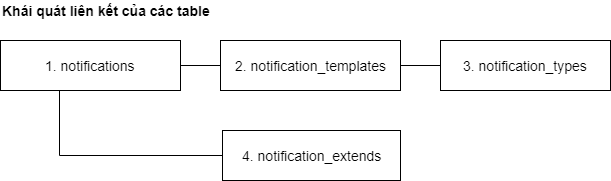

# Mô tả chức năng

## Thông báo cá nhân

1. Khi click vào icon notification trên menu header, sẽ hiện ra list notification mới nhất, có nút `Xem tất cả`. 

1. Khi click vào `Xem tất cả` thì tới danh sách đầy đủ của notification (có phân trang).

1. Khi click vô 1 notification:

    1. Nếu là notification thuộc loại cố định thì link tới page chứa thông tin làm phát sinh notification đó (giống Facebook).  
    Ví dụ: nếu bấm vô thông báo “Bạn được ủng hộ xxx đồng” thì sẽ tới trang “Ví tiền”.

    1. Nếu là thông báo đột xuất (do admin gửi thủ công) thì link tới page hiện thông tin mở rộng (`notification_extends`).

1. Khi làm màn hình nhập thông báo có extend, có thể lên sẵn danh sách những từ khoá đặt biệt để nếu trong extend có chứa từ khoá này, khi hiện thông báo sẽ thay bằng thông tin cá nhân của `user_id` ở bảng `profiles`. 

